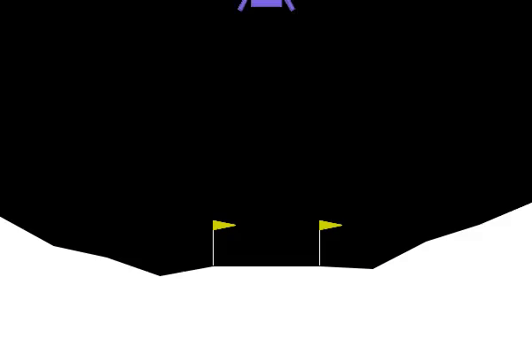

I'll update the README to include more detailed information about the custom reward function at the top, explaining how it works and how users can customize it.

# LunarLander-CustomRewards

A Proximal Policy Optimization (PPO) implementation for OpenAI Gym's LunarLander-v2, extended with:
- **Custom end-of-episode reward shaping** (smooth-landing, efficiency, stability bonuses)  
- **Hybrid supervised+reinforcement learning** from expert demonstrations

## Custom Reward Function

The project implements a custom reward function in `custom_lunar_lander.py` that significantly enhances learning by providing targeted feedback for desired landing behaviors:

### How the Custom Rewards Work

The `ReasoningLunarLander` wrapper adds three key reward components at the end of successful episodes:

1. **Smooth Landing Bonus** (+50.0): Rewards the agent for landing with a velocity magnitude below 0.1, encouraging gentle touchdowns rather than crashes.

2. **Efficiency Bonus** (up to +30.0): Rewards fuel conservation with a bonus calculated as `max(0, 30.0 - 0.1 * cumulative_fuel_usage)`. The less fuel used during the episode, the higher the bonus.

3. **Stability Bonus** (+20.0): Rewards landing with minimal angular velocity (< 0.05), encouraging proper vertical orientation upon landing.

### Customizing the Reward Function

You can easily modify the reward shaping by editing `custom_lunar_lander.py`:

- Change the bonus values to emphasize different aspects of landing performance
- Adjust thresholds (e.g., velocity < 0.1) to make requirements more or less strict
- Add new reward components based on other state variables
- Implement progressive rewards throughout the episode instead of only at termination

Example customization:
```python
# In custom_lunar_lander.py:

# To emphasize fuel efficiency more:
efficiency_bonus = max(0, 50.0 - 0.15 * self.cumulative_fuel_usage)

# To add a new reward for landing in the center:
if reward > 0:  # Successful landing
    center_landing_bonus = max(0, 25.0 - 50.0 * abs(x_pos))
    reward += center_landing_bonus
    if "custom_rewards" not in info:
        info["custom_rewards"] = {}
    info["custom_rewards"]["center_landing_bonus"] = center_landing_bonus
```

The wrapper design makes it easy to experiment with different reward formulations while keeping the core environment intact.



---

## Prerequisites

See `requirements.txt` for full dependency list (e.g. Python 3.8+, gymnasium, PyTorch, NumPy, etc.)

---

## Installation

```bash
git clone git@github.com:<your-org>/LunarLander-CustomRewards.git
cd LunarLander-CustomRewards
pip install -r requirements.txt
```

## Usage

### 1. Run with custom rewards
```bash
python reasoning_ppo.py \
  --env-id LunarLander-v2 \
  --capture-video \
  --total-timesteps 300000 \
  --learning-rate 0.00025 \
  --gamma 0.99 \
  --gae-lambda 0.97 \
  --clip-coef 0.2 \
  --num-steps 128 \
  --update-epochs 8 \
  --num-minibatches 4 \
  --ent-coef 0.0
```

### 2. Run with supervised learning (hybrid SL+RL)

First, download and extract the expert demonstrations:
```bash
# Download expert demonstration model
wget https://huggingface.co/mrm8488/ppo-LunarLander-v2/resolve/main/ppo-LunarLander-v2.zip
# Create directory and unzip
mkdir -p ./tmp
unzip ppo-LunarLander-v2.zip -d ./tmp
```

Then run the hybrid learning:
```bash
python reasoning_ppo_with_sl.py \
  --env-id LunarLander-v2 \
  --capture-video \
  --total-timesteps 300000 \
  --learning-rate 0.00025 \
  --gamma 0.99 \
  --gae-lambda 0.97 \
  --clip-coef 0.2 \
  --num-steps 128 \
  --update-epochs 8 \
  --num-minibatches 4 \
  --ent-coef 0.0 \
  --use_hybrid_learning
```

### 3. Typical PPO training (vanilla)
```bash
python reasoning_ppo.py \
  --env-id LunarLander-v2 \
  --capture-video \
  --total-timesteps 500000
```

### 4. Evaluate and record best episode
```bash
python evaluate_agent.py \
  --model-path models/LunarLander-v2__reasoning_ppo__1__1748367547 \
  --env-id LunarLander-v2 \
  --num-episodes 40 \
  --custom-rewards \
  --record-best
```

### 5. Create a GIF from recorded video
```bash
python create_gif.py \
  --video-dir ./videos/eval_best_episode_1748415752 \
  [--fps 50]
```

### 6. Parallel hyperparameter sweeps
```bash
# Basic execution (10 runs)
python parallel_experiments.py

# With custom options
python parallel_experiments.py --num-experiments 5 --max-parallel 2 --custom-rewards
```

Outputs a JSON summary of results and hyperparameters.
To adjust the hyperparameter sets, edit the `create_hyperparameter_sets()` function around line 140.

## Custom Rewards
To modify the reward-shaping scheme, edit:
```
custom_lunar_lander.py
```

## Creating GIFs

To create a GIF from a recorded video:

```bash
python create_gif.py --video-dir ./videos/eval_best_episode_TIMESTAMP
```

Options:
- `--fps INT` - Frames per second (default: 30)
- `--max-frames INT` - Maximum number of frames to include
- `--output-file FILENAME` - Custom output filename

For faster GIFs, increase the FPS value:
```bash
python create_gif.py --video-dir ./videos/eval_best_episode_TIMESTAMP --fps 50
```

The script automatically:
- Skips frames to create smoother, faster animations
- Saves GIFs in the `./gifs/` directory
- Timestamps output files to prevent overwriting

## Visualization

Generate performance graphs and visualizations from training runs:

```bash
python visualize_results.py --logdir ./runs/LunarLander-v2__reasoning_ppo__1__1748371443 --output-dir ./plots/with_sl
```

The visualization script creates comprehensive plots showing:
- Episode rewards over time
- Learning curves comparing different approaches
- Policy entropy and value loss metrics
- Success rate progression
- Fuel efficiency improvements

These visualizations help analyze the effectiveness of different reward shaping strategies and learning approaches. The plots are saved to the specified output directory and can be used to compare performance across different experimental configurations.

## Project Details

This implementation builds on the standard PPO algorithm with several key enhancements:

1. **Custom Reward Shaping**: Modifies the reward function to encourage:
   - Smooth landings (minimal impact velocity)
   - Fuel efficiency (penalizing excessive engine usage)
   - Stability throughout descent (minimizing angular velocity)
   - Proper landing orientation (rewarding vertical alignment)

2. **Hybrid Learning**: Combines traditional reinforcement learning with supervised learning from expert demonstrations to accelerate training and improve final performance.

3. **Comprehensive Evaluation**: Includes tools for detailed performance analysis, visualization, and comparison across different configurations.

The project demonstrates how domain-specific knowledge can be incorporated into reinforcement learning algorithms to significantly improve sample efficiency and overall performance in challenging control tasks.

## Credits

The PPO implementation is based on [CleanRL](https://github.com/vwxyzjn/cleanrl/tree/master), a collection of single-file reinforcement learning implementations. This project extends CleanRL's PPO implementation with custom reward shaping and hybrid learning capabilities.
